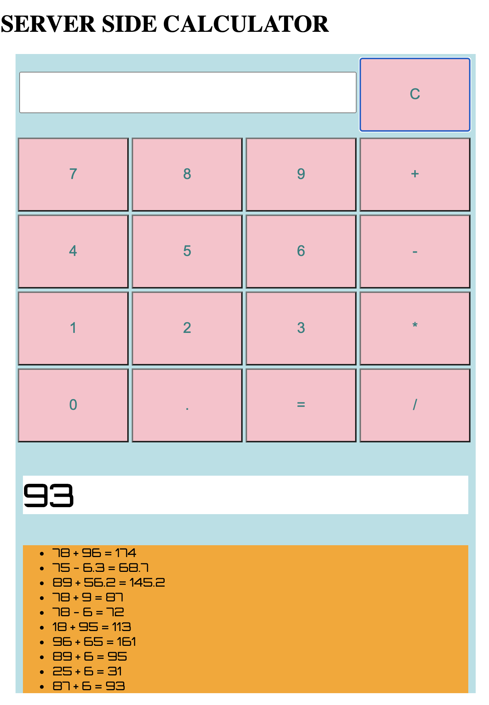

# Project Name

jQuery Server Side Calculator 

## Description

_Duration: Weekend 12 Hours_

This application simulates some of the functions of the standard arithmetic calculator. The user can input numbers via the touchpad and the application returns the answer in large print and then logs the history of all operations calculator has performed since the server has been turned on. 

## Screen shots

The application in action

##Installation

Required packages:
- gitHub repository files
- node.js
- Node package manager (npm)
- Express

1. Fork and clone the repository from gitHub
2. Initialize npm package manager at the root local folder in command line with: 'npm -init y'
3. Install node.js with command: 'npm install node'
4. Install express with command: 'npm install express'

##Built With

- html
- css
- javascript
- jQuery
- node.js

## License
[MIT](https://choosealicense.com/licenses/mit/)

## Acknowledgement
Thanks to [Prime Digital Academy](www.primeacademy.io) who equipped helped me make this application a reality. Sepcial thanks to my primary instructor, [Mary Mossman](https://github.com/mbMosman)

Special thanks to my learning group for this week from my Vatti Cohort:
- [Carl Barfuss](https://github.com/carlbarfuss)
- [Josie Fredericksen](https://github.com//freder48)
- [Yer Thao](https://github.com/yyerthao)

Extra special thanks to *Iris Maloney*, from the second grade at Heilicher Day School in Saint Louis Park, Minnesota, for her QA testing help and her consulting work on the color schemes for this applicaiton. 

## Support
If you have suggestions or issues, please email me at [steven.maloney@gmail.com](mailto:steven.maloney@gmail.com)
